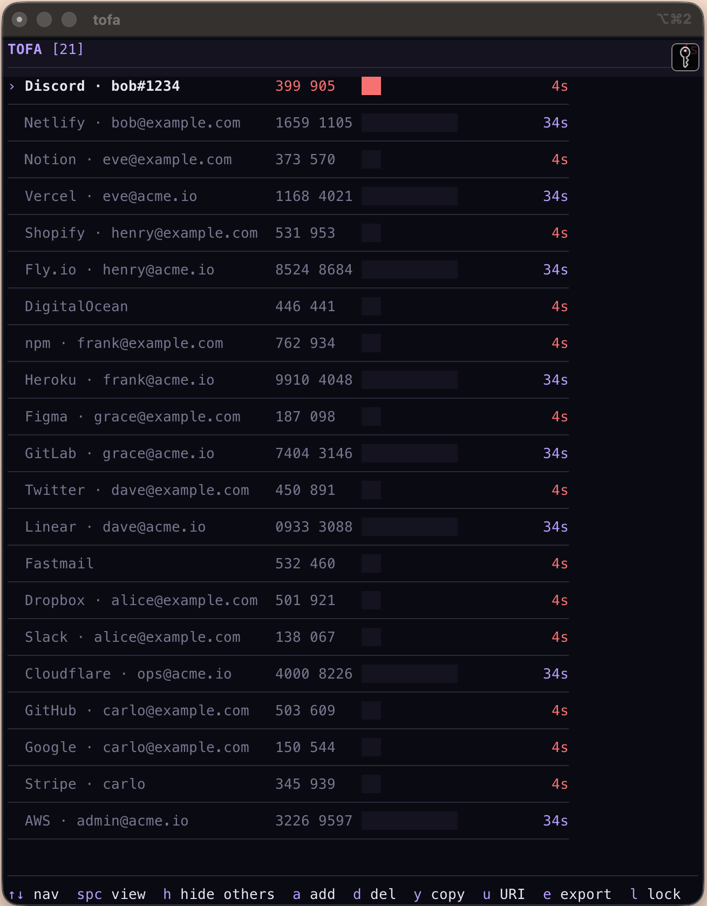
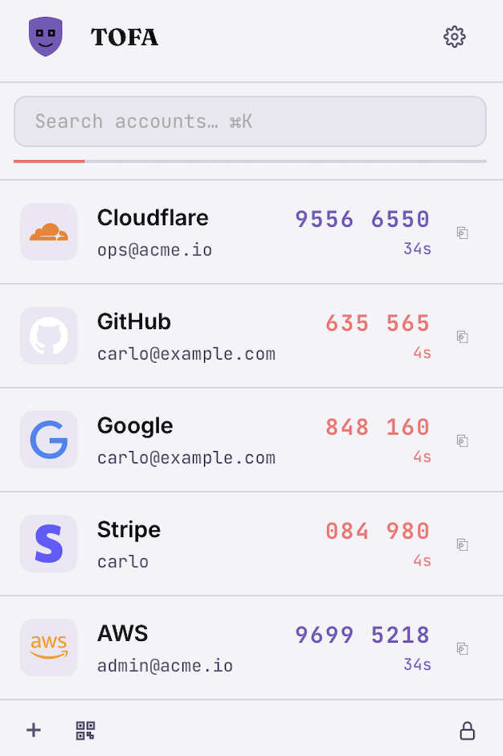

# tofa

  
  &nbsp;
  

`tofa` is an offline, encrypted 2FA tool for the terminal. Secrets stay on your
machine in an `AES-256-GCM` vault — no cloud, no account, no telemetry.

This site primarily documents the **command-line interface** and its
companion TUI. The macOS menu bar app — pictured above — reads the same
vault and is covered in the [project README](https://github.com/stratif-io/tofa).

## What's in here

- **[Getting started](./getting-started/installation.md)** — install, create a
  vault, add your first account.
- **[CLI reference](./reference/overview.md)** — every subcommand, with flags
  auto-synced to the source.
- **[Recipes](./recipes/import-from-aegis.md)** — common workflows like
  importing from Aegis or scripting with `TOFA_PASSPHRASE`.
- **[Security model](./security.md)** — what the vault protects, and how.
